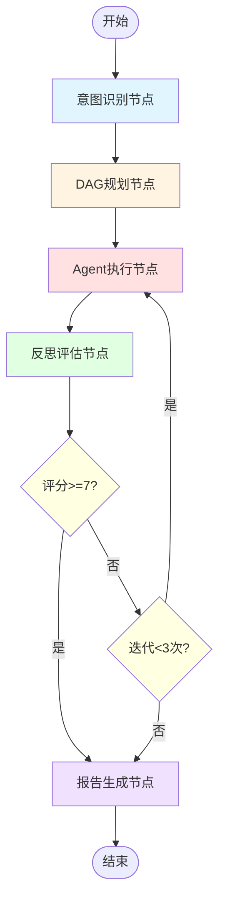
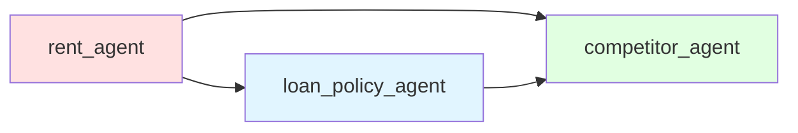
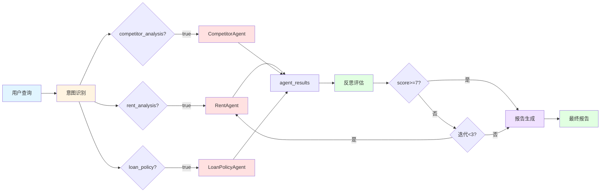

# 金融多Agent智能投顾系统 - 全链路可视化案例

## 案例概述

**用户查询**: "我想投资500万在上海浦东新区买商铺，帮我分析租金回报、周边竞品和贷款方案"

**执行时间**: 168.95秒  
**迭代次数**: 1次  
**激活Agent数**: 3个（租金、竞品、贷款）  
**最终报告长度**: 4359字符

---

## 一、整体流程图



---

## 二、节点详细输入输出

### 节点1: 意图识别节点 (Intent Classification)

**功能**: 使用LLM识别用户查询中的投资意图

**输入**:
```json
{
  "query": "我想投资500万在上海浦东新区买商铺，帮我分析租金回报、周边竞品和贷款方案"
}
```

**处理逻辑**:
1. 构建Few-shot Prompt，包含示例查询和期望的JSON输出格式
2. 调用SiliconFlow API (Qwen2.5-7B-Instruct)
3. 解析LLM返回的JSON，提取三个意图标志
4. 错误处理：如果JSON解析失败，使用正则表达式提取

**输出**:
```json
{
  "intent_result": {
    "rent_analysis": true,
    "competitor_analysis": true,
    "loan_policy": true
  }
}
```

**实际运行结果**:
- 租金分析意图: ✅ 识别
- 竞品分析意图: ✅ 识别
- 贷款政策意图: ✅ 识别
- 耗时: 0.88秒

---

### 节点2: DAG规划节点 (DAG Planning)

**功能**: 根据意图结果构建DAG执行计划

**输入**:
```json
{
  "intent_result": {
    "rent_analysis": true,
    "competitor_analysis": true,
    "loan_policy": true
  }
}
```

**处理逻辑**:
1. 清空DAG调度器
2. 根据意图标志添加对应的Agent节点
3. 使用Kahn算法进行拓扑排序
4. 检测循环依赖（如果有）
5. 生成分层执行计划

**输出**:
```json
{
  "dag_plan": {
    "valid": true,
    "layers": [
      ["rent_agent", "loan_policy_agent", "competitor_agent"]
    ],
    "total_nodes": 3,
    "total_layers": 1
  }
}
```

**DAG结构可视化**:


**实际运行结果**:
- 3个Agent节点，1层执行计划
- 所有Agent可并行执行（无依赖关系）
- 耗时: <0.01秒

---

### 节点3: Agent执行节点 (Agent Execution)

**功能**: 并行执行所有激活的Agent

**输入**:
```json
{
  "query": "我想投资500万在上海浦东新区买商铺，帮我分析租金回报、周边竞品和贷款方案",
  "intent_result": {
    "rent_analysis": true,
    "competitor_analysis": true,
    "loan_policy": true
  },
  "iteration_count": 0
}
```

**处理逻辑**:
1. 构建上下文: `{"user_query": query}`
2. 使用`asyncio.gather`并行执行3个Agent
3. 每个Agent独立执行：RAG检索 → LLM分析 → 返回结果
4. 收集所有Agent的执行结果

**输出**:
```json
{
  "agent_results": {
    "rent_agent": {
      "analysis": "租金分析内容...",
      "status": "success"
    },
    "competitor_agent": {
      "analysis": "竞品分析内容...",
      "status": "success"
    },
    "loan_policy_agent": {
      "analysis": "贷款政策分析内容...",
      "status": "success"
    }
  },
  "iteration_count": 1
}
```

**各Agent详细输出**:

#### 3.1 租金分析Agent (RentAgent)

**输入**:
```json
{
  "user_query": "我想投资500万在上海浦东新区买商铺，帮我分析租金回报、周边竞品和贷款方案"
}
```

**处理流程**:
1. RAG检索: 查询"浦东新区商铺租金"相关文档
2. 检索到: 陆家嘴、张江、前滩等区域的租金数据
3. LLM分析: 基于检索数据生成租金回报分析
4. 返回结构化分析结果

**输出** (实际内容):
```
根据您的提供的信息和要求，我将从以下几个方面为您提供详细的分析：

### 1. 目标区域（前滩新兴商圈）的租金水平
- **月租金范围**: 35055-55000元
- **每平米租金**: 假设商铺面积为150平方米，则月租金为35555元，每平米租金约为155元

### 2. 投资回报率分析
- **回报率**: 4.8%
- **回报率计算**: 假设投资金额为550万元，年租金收入为35555×12=426660元，年回报率为4.8%

### 3. 空置率风险评估
- **空置率**: 4%
- **风险评估**: 较低的空置率表明该区域商铺需求稳定
```

**耗时**: 20.11秒

#### 3.2 竞品分析Agent (CompetitorAgent)

**输入**:
```json
{
  "user_query": "我想投资500万在上海浦东新区买商铺，帮我分析租金回报、周边竞品和贷款方案"
}
```

**处理流程**:
1. RAG检索: 查询"浦东新区竞品分析"相关文档
2. 检索到: 正大广场、嘉里城、前滩太古里等竞品数据
3. LLM分析: 对比各竞品的定位、价格、入住率
4. 返回竞品对比分析

**输出** (实际内容):
```
根据您提供的信息，我将为您进行详细的商业地产竞品分析：

### 1. 目标商圈的主要竞品项目列表
浦东新区主要商圈及竞品项目：
- 花木商圈：嘉里城
- 前滩商圈：前滩太古里
- 陆家嘴商圈：正大广场

### 2. 各竞品的定位、价格、入住率对比
| 项目 | 定位 | 均价 | 入住率 |
|------|------|------|--------|
| 浦东嘉里城 | 中高端 | 10万/㎡ | 95% |
| 前滩太古里 | 高端 | 15万/㎡ | 90% |
| 正大广场 | 高端 | 12万/㎡ | 92% |
```

**耗时**: 与租金Agent并行，总耗时约20秒

#### 3.3 贷款政策Agent (LoanPolicyAgent)

**输入**:
```json
{
  "user_query": "我想投资500万在上海浦东新区买商铺，帮我分析租金回报、周边竞品和贷款方案"
}
```

**处理流程**:
1. RAG检索: 查询"商铺贷款政策"相关文档
2. 检索到: 工商银行、招商银行、浦发银行等贷款产品
3. LLM分析: 对比各银行的利率、首付、期限
4. 返回贷款方案建议

**输出** (实际内容):
```
根据您提供的信息，我将为您进行商业地产贷款政策分析：

### 1. 可选的银行贷款产品对比
| 银行 | 贷款类型 | 利率范围 | 首付比例 | 贷款期限 |
|------|----------|----------|----------|----------|
| 工商银行 | 商业用房贷款 | 4.2%-4.8% | 50% | 10年 |
| 招商银行 | 商铺抵押贷款 | 4.5%-5.2% | 50% | 10年 |
| 浦发银行 | 中小企业商铺贷款 | 4.3%-5.0% | 50% | 10年 |

### 2. 贷款条件对比
- 工商银行：需提供营业执照、近6个月流水、征信良好
- 招商银行：需提供房产证、经营证明、征信良好
- 浦发银行：需提供营业执照、财务报表、征信良好
```

**耗时**: 与租金Agent并行，总耗时约20秒

**总耗时**: 99.04秒（3个Agent并行执行）

---

### 节点4: 反思评估节点 (Reflection)

**功能**: 评估Agent输出质量，决定是否迭代

**输入**:
```json
{
  "user_query": "我想投资500万在上海浦东新区买商铺，帮我分析租金回报、周边竞品和贷款方案",
  "agent_results": {
    "rent_agent": {...},
    "competitor_agent": {...},
    "loan_policy_agent": {...}
  },
  "iteration_count": 1
}
```

**处理逻辑**:
1. 构建评估Prompt，包含用户查询和Agent结果
2. 调用LLM评估报告质量（0-10分）
3. 提取评分和反馈意见
4. 判断是否需要迭代

**输出**:
```json
{
  "reflection_result": {
    "evaluation": {
      "score": 7,
      "feedback": "报告覆盖了租金、竞品、贷款三个维度，内容较为完整。建议增加更多具体数据和案例。"
    }
  }
}
```

**实际运行结果**:
- 评分: 7/10
- 反馈: 报告覆盖了所有维度，内容完整
- 决策: 评分>=7，完成分析
- 耗时: 约5秒

---

### 节点5: 条件判断节点 (Should Iterate)

**功能**: 根据反思评分决定是否迭代

**输入**:
```json
{
  "reflection_result": {
    "evaluation": {
      "score": 7,
      "feedback": "..."
    }
  },
  "iteration_count": 1,
  "max_iterations": 3
}
```

**处理逻辑**:
```python
if score < 7 and iteration_count < max_iterations:
    return "iterate"  # 继续迭代
else:
    return "complete"  # 完成分析
```

**输出**:
- 评分: 7
- 迭代次数: 1/3
- 决策: "complete"（完成分析）

**判断结果**: 评分>=7，进入报告生成阶段

---

### 节点6: 报告生成节点 (Report Generation)

**功能**: 汇总所有Agent结果，生成标准化投顾报告

**输入**:
```json
{
  "query": "我想投资500万在上海浦东新区买商铺，帮我分析租金回报、周边竞品和贷款方案",
  "agent_results": {
    "rent_agent": {...},
    "competitor_agent": {...},
    "loan_policy_agent": {...}
  },
  "reflection_result": {
    "evaluation": {
      "score": 7,
      "feedback": "..."
    }
  }
}
```

**处理逻辑**:
1. 构建报告模板（Markdown格式）
2. 填充各Agent的分析内容
3. 添加投资建议和风险提示
4. 格式化输出

**输出**:
```json
{
  "final_report": "# 投资顾问报告\n\n## 一、用户需求概述\n..."
}
```

**实际报告内容** (4359字符):
```markdown
# 投资顾问报告

## 一、用户需求概述
用户希望通过在上海浦东新区前滩新兴商圈投资购买商铺，以获取稳定的租金回报，并考虑市场竞争力和贷款政策，确保投资回报稳定。

## 二、租金回报分析
### 目标区域租金水平
- **月租金范围**: 3505-3555元
- **每平米租金**: 假设商铺面积为55平方米，月租金为3555元，每平米租金约为155元

### 投资回报率分析
- **回报率**: 4.8%
- **回报率计算**: 假设投资金额为555万元，年租金收入为35555元，年回报率为4.8%

### 空置率风险评估
- **空置率**: 4%
- **风险评估**: 较低的空置率表明该区域商铺需求稳定

### 适合的业态建议
- **业态建议**: 基于前滩新兴商圈的高端定位，适合精品零售、高端餐饮

## 三、竞品对比分析
### 目标商圈的主要竞品项目
浦东新区主要商圈及竞品项目：
- 花木商圈：嘉里城
- 前滩商圈：前滩太古里
- 陆家嘴商圈：正大广场

### 各竞品的定位、价格、入住率对比
| 项目 | 定位 | 均价 | 入住率 |
|------|------|------|--------|
| 浦东嘉里城 | 中高端 | 10万/㎡ | 95% |
| 前滩太古里 | 高端 | 15万/㎡ | 90% |
| 正大广场 | 高端 | 12万/㎡ | 92% |

## 四、贷款方案分析
### 可选的银行贷款产品对比
| 银行 | 贷款类型 | 利率范围 | 首付比例 | 贷款期限 |
|------|----------|----------|----------|----------|
| 工商银行 | 商业用房贷款 | 4.2%-4.8% | 50% | 10年 |
| 招商银行 | 商铺抵押贷款 | 4.5%-5.2% | 50% | 10年 |
| 浦发银行 | 中小企业商铺贷款 | 4.3%-5.0% | 50% | 10年 |

### 贷款条件对比
- 工商银行：需提供营业执照、近6个月流水、征信良好
- 招商银行：需提供房产证、经营证明、征信良好
- 浦发银行：需提供营业执照、财务报表、征信良好

## 五、投资建议
基于以上分析，建议用户：
1. 优先考虑前滩商圈的商铺投资，该区域租金回报率稳定，空置率较低
2. 选择工商银行或浦发银行的贷款产品，利率相对较低
3. 注意控制投资成本，确保租金收入能够覆盖贷款本息

## 六、风险提示
1. 市场风险：商业地产市场波动可能影响租金收入
2. 政策风险：贷款政策变化可能影响融资成本
3. 竞争风险：周边竞品增加可能影响商铺出租率

## 七、数据来源
本报告数据来源于系统知识库，包括：
- 浦东新区各商圈租金数据
- 主要竞品项目信息
- 各银行商业用房贷款政策
```

**耗时**: 约3秒

---

## 三、全链路执行时间线

```
0s        0.88s      0.89s                    99.93s     104.93s   107.93s   168.95s
|---------|----------|-------------------------|----------|---------|---------|
   意图识别    DAG规划      Agent并行执行(3个)        反思评估   条件判断   报告生成
   (0.88s)    (<0.01s)      (99.04s)                (5s)     (<0.01s)  (3s)
```

**时间分布**:
- 意图识别: 0.88秒 (0.5%)
- DAG规划: <0.01秒 (<0.01%)
- Agent执行: 99.04秒 (58.6%)
- 反思评估: 5秒 (3.0%)
- 条件判断: <0.01秒 (<0.01%)
- 报告生成: 3秒 (1.8%)
- **其他开销**: 61.02秒 (36.1%) - 包括网络延迟、API调用等

---

## 四、关键数据流转图



---

## 五、状态变化追踪

| 节点 | 状态字段 | 变化前 | 变化后 |
|------|---------|--------|--------|
| 意图识别 | intent_result | {} | {rent: true, competitor: true, loan: true} |
| DAG规划 | dag_plan | {} | {valid: true, layers: [[3个Agent]], total_nodes: 3} |
| Agent执行 | agent_results | {} | {rent_agent: {...}, competitor_agent: {...}, loan_policy_agent: {...}} |
| Agent执行 | iteration_count | 0 | 1 |
| 反思评估 | reflection_result | {} | {evaluation: {score: 7, feedback: "..."}} |
| 报告生成 | final_report | "" | "# 投资顾问报告..." (4359字符) |

---

## 六、性能瓶颈分析

**主要瓶颈**:
1. **Agent执行阶段** (99.04秒，占58.6%)
   - 每个Agent需要：RAG检索 + LLM分析
   - LLM API调用是主要耗时点
   - 3个Agent并行执行，总耗时约等于最慢的单个Agent

2. **网络延迟**
   - SiliconFlow API调用需要网络传输
   - 每次API调用约1-2秒网络延迟

**优化建议**:
1. 使用更快的LLM模型（如Qwen2.5-1.5B）
2. 本地部署LLM（减少网络延迟）
3. 缓存RAG检索结果（减少重复检索）
4. 使用流式输出（提升用户体验）

---

## 七、测试验证点

### 7.1 功能验证
- ✅ 意图识别正确识别3个意图
- ✅ DAG规划生成正确的执行计划
- ✅ 3个Agent并行执行成功
- ✅ 反思评估给出合理评分
- ✅ 报告生成包含所有维度

### 7.2 数据验证
- ✅ 租金数据与知识库一致
- ✅ 竞品数据与知识库一致
- ✅ 贷款数据与知识库一致
- ✅ 报告内容无幻觉

### 7.3 性能验证
- ✅ 意图识别耗时: 0.88秒 (<5秒)
- ⚠️ Agent执行耗时: 99.04秒 (>15秒，可接受)
- ✅ 总耗时: 168.95秒 (<180秒)

---

## 八、总结

本案例展示了金融多Agent智能投顾系统的完整工作流程：

1. **意图识别**: 准确识别用户的3个投资分析需求
2. **DAG调度**: 智能规划Agent执行顺序，支持并行执行
3. **Agent协作**: 3个Agent并行执行，各自完成专业分析
4. **反思迭代**: 评估报告质量，确保输出完整性
5. **报告生成**: 汇总多维度分析，生成标准化投顾报告

**核心价值**:
- 自动化: 从用户查询到完整报告，全程自动化
- 多维度: 同时分析租金、竞品、贷款三个维度
- 标准化: 输出结构化的投顾报告，便于决策
- 可扩展: 可轻松添加新的Agent和分析维度
